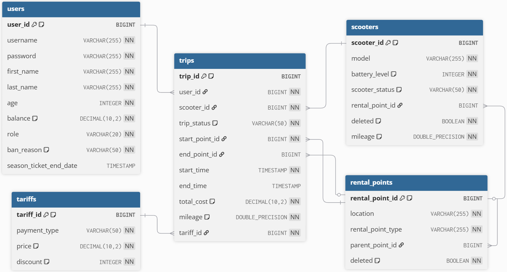

# ScooterRental

RESTful web-проект системы для управления сетью проката электросамокатов.

## Содержание

* **Структура проекта**
* **Стек технологий**
* **Схема БД**
* **Запуск и остановка проекта**
* **Стартовые данные**

## Структура проекта

Проект реализован по многомодульной архитектуре Maven:

* **app** - основной модуль, содержит конфигурацию Spring Boot, входную точку в приложение и интеграционные тесты.
* **controller** - содержит REST-контроллеры для обработки HTTP-запросов, а также перехватчик исключений.
* **model** - содержит сущности, перечисления и исключения.
* **repository** - содержит интерфейсы DAO и их реализацию с использованием Hibernate.
* **service** - содержит бизнес-логику системы, DTO-классы и MapStruct-мапперы.
* **logs** - содержит логи работы приложения.
* **Dockerfile** - инструкции для сборки Docker-образа приложения.
* **docker-compose.yml** - конфигурация для запуска инфраструктуры.
* **start.bat** - скрипт запуска приложения.
* **stop.bat** - скрипт остановки приложения.

## Стек технологий
* **Java 17**
* **Spring Boot 3.2**
* **Hibernate**
* **PostgreSQL**
* **Flyway**
* **Docker & Docker Compose**
* **MapStruct**
* **JUnit 5, Mockito, Testcontainers**
* **JWT**

## Схема БД

## Запуск и остановка проекта
### Перед запуском необходимо убедиться, что на компьютере имеется: 
* Запущенный Docker Desktop 
* Java 17
* Maven

### Запуск проекта:
Для запуска приложения нужно скопировать эту папку проекта на свой компьютер, запустить скрипт `start.bat` и дождаться конца загрузки:

Система будет доступна по адресу: http://localhost:8080

После запуска приложения документация Swagger UI доступна по адресу:
http://localhost:8080/swagger-ui/index.html

### Остановка проекта:
Для остановки приложения нужно запустить скрипт `stop.bat`.

## Стартовые данные
При запуске приложения, в случае, если не будет обнаружено ни одного пользователя, автоматически создастся пользователь с правами администратора со следующими входными данными:
* **Логин**: `admin`
* **Пароль**: `admin`